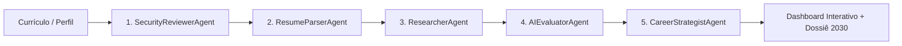

# 🚀 CarreiraIA 2030 — Plataforma Agêntica de Inteligência de Carreira

> **Projeto de Avaliação Profissional e Impacto da Inteligência Artificial no Mercado de Trabalho até 2030**  
> Desenvolvido com base no *Guia Universal de Desenvolvimento Agêntico Full-Stack Multi-Stack* (`agentes_universais.md`) e fundamentado nos relatórios oficiais do **Fórum Econômico Mundial (WEF — Future of Jobs Report 2025/2030)** e **McKinsey Global Institute**.

---

## 📌 Visão do Projeto

Até 2030, a revolução impulsionada pela Inteligência Artificial Generativa e Agentes Autônomos transformará radicalmente o mundo do trabalho:
- **+78 milhões** de empregos líquidos projetados globalmente (170 milhões de novas funções criadas vs. 92 milhões de postos rotineiros deslocados).
- **39% das competências essenciais atuais** serão transformadas ou desvalorizadas até 2030.
- A camada de **execução mecânica** (escrever código básico, preencher planilhas, triagem de contratos, atendimento padrão) está sendo absorvida por IAs. O valor humano migrou para a **formulação de problemas, pensamento crítico, orquestração agêntica e julgamento ético**.

O **CarreiraIA 2030** é uma ferramenta inteligente criada para avaliar uma pessoa e seu currículo, respondendo com precisão:
1. **Qual é o seu Risco Real de Automação de Rotinas até 2030?**
2. **Qual o seu Potencial de Multiplicação de Produtividade com IA (Augmentation Potential)?**
3. **Quais são os Gaps Críticos de Competência entre o seu perfil atual e as exigências do mercado para 2030?**
4. **Quais tarefas diárias você deve parar de fazer e o que deve aprender a orquestrar?**
5. **Qual é o seu Roadmap Ano a Ano (2026, 2027-2028, 2029-2030) para continuar indispensável e valorizado?**

---

## 🤖 Arquitetura Multiagente (`agentes_universais.md`)

A ferramenta opera através de **5 agentes inteligentes especializados**, garantindo privacidade, precisão econométrica e recomendações acionáveis:



1. **🛡️ `SecurityReviewerAgent` (`agents/security_reviewer.py`):**
   - Inspeciona o currículo e aplica conformidade com a LGPD, mascarando dados pessoais sensíveis (CPF, e-mails, telefones, endereços) antes de qualquer análise.
2. **📑 `ResumeParserAgent` (`agents/resume_parser.py`):**
   - Extrai texto de PDFs ou formulários, categorizando senioridade, anos de experiência, ferramentas e dividindo as tarefas diárias entre rotineiras/repetitivas e cognitivas/estratégicas.
3. **📊 `ResearcherAgent` (`agents/researcher.py`):**
   - Consulta o banco de tendências oficial (`data/wef_benchmark_2030.json`) com mais de 50 ocupações mapeadas a partir de dados do WEF, McKinsey e O*NET.
4. **⚡ `AIEvaluatorAgent` (`agents/ai_evaluator.py`):**
   - Calcula o Risco de Automação ajustado, o Índice de Simbiose (Produtividade Humano+IA) e plota o Radar de Competências 2030 nas 6 dimensões essenciais.
5. **🎯 `CareerStrategistAgent` (`agents/career_strategist.py`):**
   - Desenvolve o Roadmap tático de requalificação (2026-2030), sugere certificações, transições de carreira (Career Pivots) e gera o Dossiê Executivo para download.

---

## 💻 Como Executar a Aplicação (Streamlit)

### Pré-requisitos
- Python 3.10 ou superior instalado no seu computador.

### Opção 1: Execução com 1 Clique (Windows)
Basta dar um duplo clique no arquivo:
```bash
run_app.bat
```
O script instalará automaticamente as dependências e abrirá a aplicação no seu navegador padrão (`http://localhost:8501`).

### Opção 2: Execução via Terminal
1. Abra o terminal na pasta do projeto:
```bash
cd "c:\Users\CASA DOS ELETRÔNICOS\OneDrive\Desktop\projeto 2 entrega"
```

2. Instale as bibliotecas necessárias:
```bash
pip install -r requirements.txt
```

3. Inicie o aplicativo Streamlit:
```bash
streamlit run app.py
```

---

## 🎯 Recursos e Funcionalidades da Ferramenta

- **⚡ Presets com 1 Clique na Barra Lateral:** Teste instantaneamente com perfis reais de mercado (Desenvolvedor Júnior, Tech Lead Sênior, Assistente Administrativo, Analista Financeiro, Advogado, Designer Gráfico, Atendente de SAC, Gerente de Projetos, etc.).
- **📄 Leitura de Currículo:** Suporte nativo para upload de arquivos em **PDF** ou **TXT**, além de formulário guiado e colagem de texto.
- **🔄 Visualizador do Pipeline de Agentes:** Acompanhe em tempo real com `st.status` as etapas de raciocínio de cada agente.
- **📊 Gráfico Radar Polar (Plotly):** Comparação visual entre as habilidades atuais do candidato e o benchmark exigido em 2030 nas 6 dimensões do WEF.
- **📋 Auditoria de Rotina em 3 Colunas:**
  - ⚠️ *Tarefas em Risco Iminente de Automação até 2028*
  - ⚡ *Tarefas Híbridas (onde a IA é seu copiloto)*
  - 🛡️ *Fortalezas Exclusivamente Humanas (ética, empatia, estratégia)*
- **🗺️ Roadmap Anual de Requalificação (2026 - 2030):** Cronograma de metas, ferramentas para dominar e certificações globais sugeridas.
- **🔀 Transições de Carreira (Pivots):** Alternativas de migração para cargos adjacentes em alta valorização e menor risco de substituição.
- **📥 Download de Dossiê Executivo:** Botão para exportar o relatório analítico completo em formato Markdown (.md) para guardar ou imprimir.

---

## 📁 Estrutura do Repositório

```txt
projeto 2 entrega/
├── docs/
│   └── specs/
│       ├── main.md                 # Visão de produto, requisitos e métricas
│       ├── architecture.md         # Arquitetura multiagente e fluxo de dados
│       └── domain.md               # Modelo de domínio de carreira e taxonomia 2030
├── .claude/
│   └── agents/                     # Especificações formais dos subagentes universais
│       ├── security-reviewer.md
│       ├── resume-parser.md
│       ├── researcher.md
│       ├── ai-evaluator.md
│       └── career-strategist.md
├── agents/                         # Implementação em Python dos agentes
│   ├── __init__.py
│   ├── security_reviewer.py
│   ├── resume_parser.py
│   ├── researcher.py
│   ├── ai_evaluator.py
│   └── career_strategist.py
├── data/
│   └── wef_benchmark_2030.json     # Base com ocupações e projeções WEF/McKinsey
├── app.py                          # Aplicação principal Streamlit
├── requirements.txt                # Dependências Python (streamlit, plotly, pandas, pypdf)
├── run_app.bat                     # Inicializador com 1 clique para Windows
├── CLAUDE.md                       # Diretrizes de desenvolvimento agêntico
└── README.md                       # Documentação completa do projeto
```
